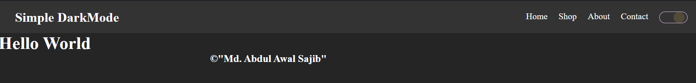



# **# **Add a Dark Mode Toggle with HTML, CSS, and JavaScript****
## Quick Guide to Building a Simple Dark Mode Feature
 Follow these steps to create a basic dark mode toggle switch using HTML, CSS, and JavaScript. This implementation also saves the user’s theme preference with  `localStorage`, so the dark mode persists across sessions.

 preview: 
 

**Step1: create index.html . you can copy the html file from my github .**
Start by setting up a simple HTML structure. You can also find this code on my  GitHub. Here’s the main toggle button:

index.html

    <body id="_body">
         

            

        

    
        
    </body>

  

### Step 2: Style the Dark Mode Toggle with CSS
Define the base styles for the toggle switch and the circle indicator:

    #dark{
    
    display: inline-block;
    
    width: 50px;
    
    border: 1px  solid  #f0cff0;
    
    border-radius: 25px;
    
    }

    #circle{
    
    width: 20px;
    
    height: 20px;
    
    border-radius: 100%;
    
    background-color: #ffcc00;
    
    }

## - Now, create additional classes to toggle the circle position and apply dark mode styling:

   
    .toggle{
     margin-left: 50%;
    
    }
    
    .dark_mode{
     background: #252526  !important;
     color: #fff;
    
    }

**Now We’ll apply javascript to save our background colour & button state in localStorage.**

  

### Step 3: JavaScript for Theme Persistence

    const  circle  =  document.getElementById("circle");
    const  dark_button=  document.getElementById("dark")
    const  body  =  document.getElementById("_body")

  

### Step 4: Theme Handling Logic

-   Here if theme key/variable === dark we’ll run darkMode function other wise we’ll execute lightMode function
    

  

### Step 5: Create the Dark and Light Mode Functions

Define the functions to add or remove dark mode styling based on the theme setting:

    const  theme  =  localStorage.getItem("theme")
    theme  ===  "dark"  ?  darkMode() :  lightMode()

  

Let’s create darkMode & LightMode function:

     function darkMode() {
  
         body.classList.add("dark_mode")
         circle.classList.add("toggle")
         circle.style.background = "#E2EAF4";
 
         localStorage.setItem("theme", "dark")
    }
    
    function lightMode() {
    
      body.classList.remove("dark_mode");
      circle.classList.remove("toggle")
      circle.style.background = "#524b38";
      localStorage.setItem("theme", "light")
    
    }

### Step 6: Add Toggle Functionality to the Button

Finally, set up an event listener on the button to switch themes and update  `localStorage`:

  

    dark_button.addEventListener("click", () => {
    
    circle.classList.toggle("toggle");
    
    if (circle.classList.contains("toggle")) {
    
    localStorage.setItem("theme", "dark")
    
    }else{
    
    localStorage.setItem("theme", "light")
    
    }

	  const  theme  =  localStorage.getItem("theme")
    
    theme  ===  "dark"  ?  darkMode() :  lightMode()
    
    })

  

  

Hope this guide helps!
 [Follow me on Facebook:](https://www.facebook.com/mdsajib201/)

